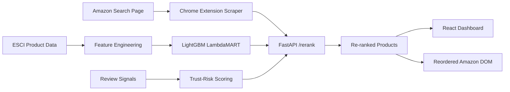

# Search Re-Ranker

An applied ML prototype that re-ranks ecommerce search results around relevance, review trust signals, and sponsored-result exposure. The project includes a FastAPI ranking service, trained LightGBM LambdaMART model, review-risk scoring pipeline, React demo dashboard, and a Chrome extension that can reorder live Amazon search-result cards.

## Why It Exists

Ecommerce search is often optimized for a mix of relevance, ads, marketplace incentives, and engagement. That can make it harder for users to identify products that are both relevant and trustworthy. Search Re-Ranker explores a user-first alternative: keep relevance high while surfacing review quality signals and reducing the dominance of sponsored placements.

## What It Does

- Trains a LambdaMART learning-to-rank model on Amazon ESCI relevance labels.
- Extracts lightweight lexical ranking features from query/product text.
- Computes review trust-risk signals from rating distribution, review count, verified-purchase signals, and review text samples.
- Applies mode-based re-ranking: balanced, relevance-focused, or fairness/trust-focused.
- Provides a React dashboard for before/after ranking comparisons.
- Provides a Chrome extension that scrapes Amazon search cards, calls the local API, and reorders the page with rank/trust badges.

## Architecture



## Project Structure

```text
api/          FastAPI service and ranking endpoints
extension/    Chrome extension for live Amazon search re-ranking
features/     ESCI feature engineering scripts
models/       Training scripts and saved model artifacts
optimizer/    Offline multi-objective optimization experiment
scripts/      Environment verification helper
ui/           React + Vite demo dashboard
```

## Current Metrics

The saved LambdaMART model reports:

- NDCG@5: 0.9014
- NDCG@10: 0.9114

These are model validation metrics from the ESCI relevance task. The live app's trust and sponsored-placement metrics are demonstration metrics from the products sent to the API, not a claim of production-grade fake-review detection.

## Setup

Create and activate a Python environment, then install backend dependencies:

```powershell
python -m venv venv
.\venv\Scripts\Activate.ps1
pip install -r requirements.txt
```

Install UI dependencies:

```powershell
cd ui
npm install
```

The raw datasets are not committed. Expected local data paths:

```text
data/raw/esci/examples.parquet
data/raw/esci/products.parquet
data/raw/reviews/Reviews.csv
```

Generated processed files are also ignored by git:

```text
data/processed/features_v1.parquet
data/processed/product_trust_scores.parquet
```

## Run The Backend

```powershell
uvicorn api.main:app --reload --port 8000
```

Useful endpoints:

- `GET /health`
- `GET /search?q=wireless headphones&n=10`
- `POST /rerank`
- `POST /evaluate`
- `GET /stats`

## Run The React Demo

```powershell
cd ui
npm run dev
```

The Vite dev server proxies `/api/*` to `http://localhost:8000`.

## Use The Chrome Extension

1. Start the FastAPI backend on `localhost:8000`.
2. Open Chrome extensions and enable Developer Mode.
3. Load `extension/` as an unpacked extension.
4. Visit an Amazon search results page.
5. Click the floating `Re-Rank` button.

## Model Notes

The ranking model is trained with LightGBM LambdaMART using ESCI query/product labels. Review trust-risk scoring combines live scraped signals when available and falls back to offline product trust scores when available.

The offline `optimizer/` folder contains an NSGA-II experiment. The live API currently uses transparent mode-based weighting rather than running NSGA-II per request.

## Limitations

- Amazon DOM scraping can break when page layouts change.
- Review trust-risk scoring is heuristic unless validated against labeled fake-review data.
- The Chrome extension depends on a local backend and is not packaged for store distribution.
- Raw datasets are large and must be obtained separately.
- The app is a research/prototype system, not a production recommender.

## Portfolio Story

This project is strongest when presented as an end-to-end applied ML system: dataset training, model serving, browser automation, live ranking intervention, and an explainable UI. The most important next improvements are a short demo video, a small evaluation report across representative queries, and tests around the trust/ranking logic.
