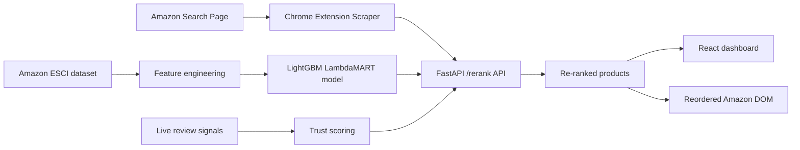

# Search Re-Ranker

Search Re-Ranker is an end-to-end applied ML project that improves ecommerce search results using learning-to-rank, live review trust signals, and sponsored-result penalties. It combines a FastAPI backend, a trained LightGBM LambdaMART ranker, a React dashboard, and a Chrome extension that can re-order live Amazon search results in the browser.

**Live demo:** https://search-reranker.vercel.app

## Highlights

- **LambdaMART ranking model** trained on Amazon ESCI relevance labels.
- **Live trust scoring** from scraped review signals including rating distribution, review counts, verified-purchase ratio, and review text quality.
- **Mode-based re-ranking** with `balanced`, `relevance`, and `fair` strategies.
- **FastAPI service** with search, rerank, evaluation, health, and aggregate stats endpoints.
- **React + Vite dashboard** for before/after ranking inspection.
- **Chrome extension** that reorders Amazon search result cards and overlays ranking/trust information.
- **Dockerized backend** for simple deployment.

## Why this project exists

Marketplace search rankings often optimize for a blend of relevance, monetization, engagement, and ad exposure. This project explores a more user-centered alternative: keep relevance strong while reducing overexposure of sponsored items and surfacing product trust signals.

## How it works



## Core capabilities

### 1. Learning-to-rank relevance
The backend loads a saved LightGBM model and predicts a relevance score for each candidate product using lexical overlap and metadata features derived from the query and product fields.

### 2. Live review trust scoring
For products sent from the Chrome extension, the API computes a trust score using:

- review count confidence
- five-star bombing detection
- bimodal rating-distribution analysis
- rating sweet-spot heuristics
- verified-purchase ratio
- review text quality and generic-phrase detection

If live review data is unavailable, the system falls back to offline trust scores from processed product trust artifacts.

### 3. Multi-objective re-ranking
The final score combines:

- normalized relevance score
- normalized trust score
- sponsored-result penalty

Available modes:

- `balanced` → default user-first mix
- `relevance` → prioritize ranking quality more heavily
- `fair` → give more weight to trust and sponsored suppression

## Project structure

```text
api/          FastAPI backend and ranking endpoints
extension/    Chrome extension for Amazon result re-ranking
features/     Feature engineering scripts for training data
models/       Trained ranking model and feature metadata
optimizer/    Offline NSGA-II optimization experiments
scripts/      Local environment verification utilities
ui/           React + Vite dashboard
data/         Raw and processed data directories (not fully committed)
```

## Current metrics

Saved model validation metrics:

- **NDCG@5:** 0.9014
- **NDCG@10:** 0.9114

These metrics come from the ESCI relevance task. Trust scoring and sponsored-demotion metrics shown by the live app are demo/prototype outputs from supplied products, not claims of production-grade fake-review detection.

## Tech stack

### Backend
- FastAPI
- LightGBM
- Pandas / NumPy / PyArrow
- Pydantic

### Frontend
- React 19
- Vite
- Tailwind CSS
- Axios
- Lucide React

### Extension
- Chrome Extension Manifest V3
- JavaScript + CSS content scripts

## Setup

### Prerequisites

- Python 3.10+
- Node.js 18+
- npm
- Chrome or Chromium-based browser

### 1. Clone and install backend dependencies

```bash
git clone https://github.com/AthulRm18/search-reranker.git
cd search-reranker
python -m venv venv
```

**Windows PowerShell**

```powershell
.\venv\Scripts\Activate.ps1
pip install -r requirements.txt
```

**macOS / Linux**

```bash
source venv/bin/activate
pip install -r requirements.txt
```

### 2. Install frontend dependencies

```bash
cd ui
npm install
cd ..
```

## Data requirements

Large raw datasets are not committed to the repository. Expected local files:

```text
data/raw/esci/examples.parquet
data/raw/esci/products.parquet
data/raw/reviews/Reviews.csv
```

Expected generated artifacts:

```text
models/ranker_v1.lgb
models/feature_cols.json
data/processed/features_v1.parquet
data/processed/product_trust_scores.parquet
```

## Run locally

### Start the backend

```bash
uvicorn api.main:app --reload --port 8000
```

### Start the React UI

```bash
cd ui
npm run dev
```

The Vite dev server proxies `/api/*` requests to `http://localhost:8000`.

### Load the Chrome extension

1. Start the FastAPI backend on `http://localhost:8000`.
2. Open `chrome://extensions`.
3. Enable **Developer mode**.
4. Click **Load unpacked**.
5. Select the `extension/` folder.
6. Open an Amazon search results page on a supported domain.
7. Use the extension popup or floating re-rank control.

Supported Amazon domains currently include:

- `amazon.com`
- `amazon.in`
- `amazon.co.uk`
- `amazon.de`
- `amazon.ca`

## API overview

### Main endpoints

- `GET /health`
- `GET /search?q=<query>&n=<count>`
- `POST /rerank`
- `POST /api/rerank`
- `POST /evaluate`
- `POST /stats/log`
- `GET /stats`

### Example rerank request

```json
{
  "query": "wireless headphones",
  "mode": "balanced",
  "products": [
    {
      "product_id": "B000000001",
      "product_title": "Wireless Bluetooth Headphones",
      "product_description": "Noise cancelling over-ear headphones",
      "product_bullet_point": "40h battery, BT 5.3",
      "product_brand": "ExampleBrand",
      "product_color": "Black",
      "original_rank": 1,
      "sponsored": true,
      "rating": 4.8,
      "review_count": 2450,
      "rating_distribution": [44, 31, 120, 410, 1845],
      "review_samples": ["Great sound and battery life", "Comfortable for long use"],
      "verified_count": 6
    }
  ]
}
```

## Deployment

The repository includes a `Dockerfile` for packaging the backend service.

```bash
docker build -t search-reranker .
docker run -p 8000:8000 search-reranker
```

The app homepage is configured at **search-reranker.vercel.app** for the web UI.

## Limitations

- Amazon DOM scraping can break when page structure changes.
- Trust scoring is heuristic and should not be interpreted as robust fake-review detection.
- The extension currently depends on a local backend at `localhost:8000`.
- Required training/data artifacts are not bundled in the repository.
- This is a prototype and portfolio project, not a production ecommerce ranking system.

## Portfolio / resume framing

This project demonstrates:

- applied machine learning with learning-to-rank
- ML model serving with FastAPI
- explainable ranking and trust features
- browser extension integration with a local ML API
- full-stack product thinking across model, API, UI, and user workflow

## Possible next improvements

- package the extension for easier installation
- add reproducible training scripts and documented data-prep steps
- add tests for API scoring and extension scraping behavior
- persist stats to a database instead of in-memory storage
- add screenshots/GIFs to better showcase the before/after UX
